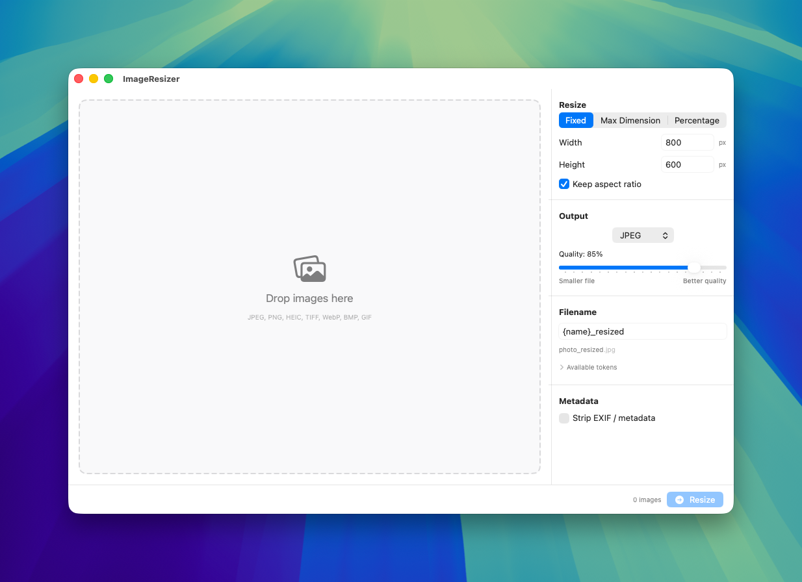
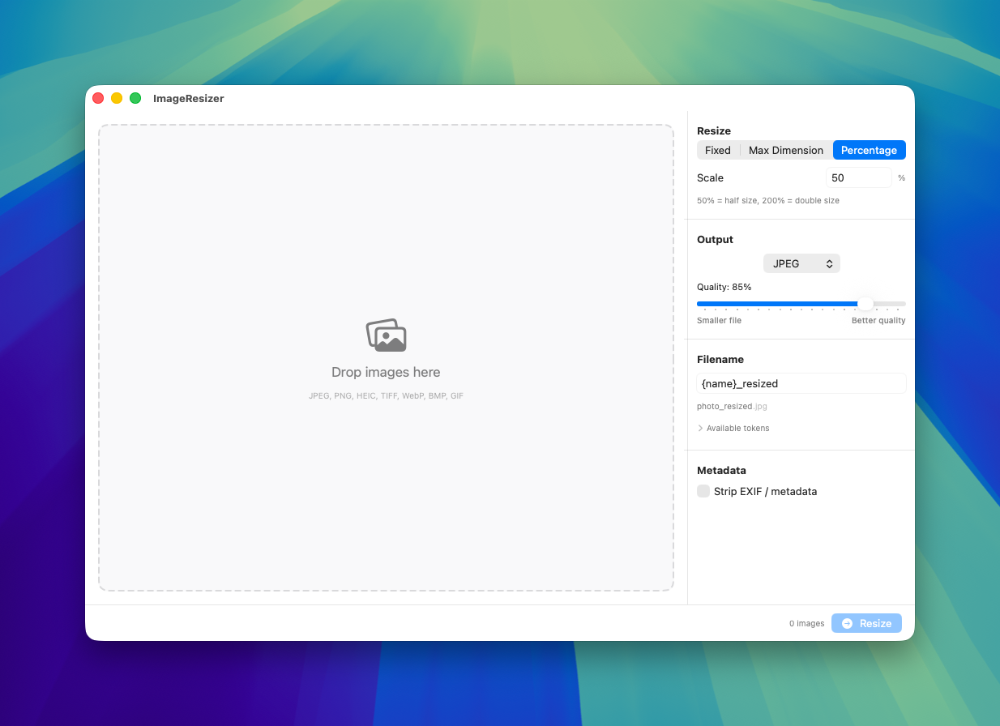
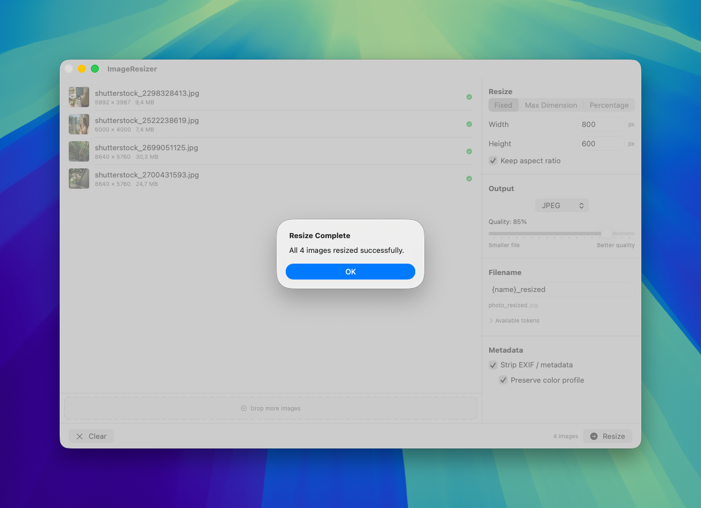

# ImageResizer

A native macOS app for batch image resizing. Drop your images in, pick your settings, and resize — all in one click.

Built with Swift and SwiftUI. No third-party dependencies.

## Screenshots

| Fixed Dimensions | Max Dimension | Percentage | Batch Complete |
|---|---|---|---|
|  |  |  |  |

## Features

- **Drag & drop** — drop individual images or entire folders
- **Three resize modes** — fixed dimensions, max dimension (proportional), or percentage scaling
- **Format conversion** — output as JPEG, PNG, HEIC, or TIFF, or keep the original format
- **Filename templates** — use tokens like `{name}`, `{width}`, `{height}`, `{date}`, `{index}` to build any naming convention
- **Metadata stripping** — optionally remove EXIF data (GPS, camera info, timestamps) while preserving color profiles
- **Batch processing** — process hundreds of images at once with per-image progress tracking
- **Remembers settings** — your preferences persist between app launches

## Requirements

- macOS 13.0 (Ventura) or later
- Xcode 15+ to build from source

## Building

1. Clone the repo
2. Open `ImageResizer.xcodeproj` in Xcode
3. Press `Cmd+R` to build and run

No CocoaPods, SPM packages, or external dependencies needed — everything uses Apple's built-in frameworks (SwiftUI, CoreImage, ImageIO).

## Tech Stack

| Component | Technology |
|---|---|
| Language | Swift 5.9+ |
| UI | SwiftUI |
| Image processing | CoreImage, CoreGraphics, ImageIO |
| Concurrency | Swift async/await |

## Privacy

ImageResizer runs entirely on your Mac. No data is collected, transmitted, or shared. See the [Privacy Policy](PRIVACY.md) for details.

## License

MIT

## Links

- [Issues & Support](https://github.com/PendoNL/macos-image-resizer/issues)
- [Pendo](https://pendo.nl)
